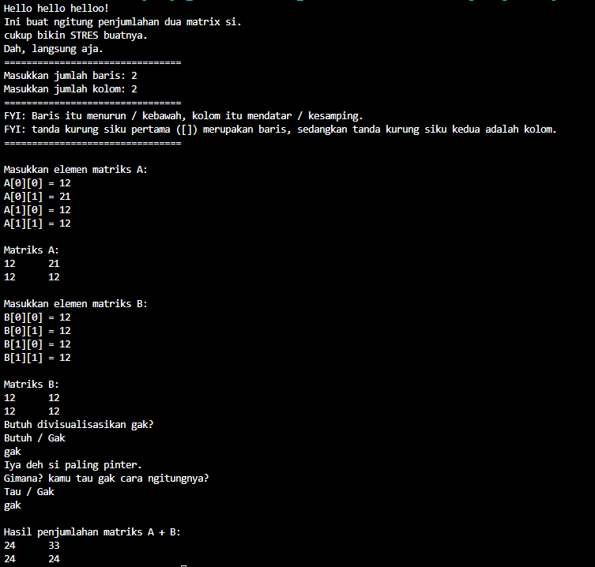

# Soal3SulitNo2
Sebelumnya, kita liat dulu deskripsi soalnya.

Buatlah sebuah program dalam bahasa Java untuk melakukan penjumlahan dua buah matriks. Matriks tersebut akan dimasukkan oleh pengguna dan hasil penjumlahannya akan ditampilkan.

First impression: "huh? Matrix?", i forgot how to solve a matrix question. And i ended up learning matrix once again... After i understand that ~~shit~~ again, i know how to answer a matrix question, but i ended up don't know how to make a code to solve a matrix question. 

But atleast, i understand a bit. This is how:
1. caraku mengumpulkan inputan
2. caraku menghitung matrix.
3. display the matrix.

this is **NOT EASY** ANYMORE. I asked google how to make a similar code. And.. it's time for cooking.

This is how:
1. 
int[][] matriksA = new int[baris][kolom];
        int[][] matriksB = new int[baris][kolom];
        int[][] hasil = new int[baris][kolom];
        System.out.println("================================");
        System.out.println("FYI: Baris itu menurun / kebawah, kolom itu mendatar / kesamping.");
        System.out.println("FYI: tanda kurung siku pertama ([]) merupakan baris, sedangkan tanda kurung siku kedua adalah kolom.");
        System.out.println("================================");        
        System.out.println("\nMasukkan elemen matriks A:");
        for (int i = 0; i < baris; i++) {
            for (int j = 0; j < kolom; j++) {
                System.out.print("A[" + i + "][" + j + "] = ");
                matriksA[i][j] = input.nextInt();
            }
        }

        System.out.println("\nMatriks A:");
        for (int i = 0; i < baris; i++) {
            for (int j = 0; j < kolom; j++) {
                System.out.print(matriksA[i][j] + "\t");
            }
            System.out.println();
        }

        System.out.println("\nMasukkan elemen matriks B:");
        for (int i = 0; i < baris; i++) {
            for (int j = 0; j < kolom; j++) {
                System.out.print("B[" + i + "][" + j + "] = ");
                matriksB[i][j] = input.nextInt();
            }
        }

        System.out.println("\nMatriks B:");
        for (int i = 0; i < baris; i++) {
            for (int j = 0; j < kolom; j++) {
                System.out.print(matriksB[i][j] + "\t");
            }
            System.out.println();
        }

2. for (int i = 0; i < baris; i++) {
            for (int j = 0; j < kolom; j++) {
                hasil[i][j] = matriksA[i][j] + matriksB[i][j];
            }
        }

        System.out.println("\nHasil penjumlahan matriks A + B:");
        for (int i = 0; i < baris; i++) {
            for (int j = 0; j < kolom; j++) {
                System.out.print(hasil[i][j] + "\t");
            }
            System.out.println();
        }
3.  for (int i = 0; i < baris; i++) {
                    for (int j = 0; j < kolom; j++) {
                        System.out.print(matriksA[i][j] + "\t");
                    }
                    System.out.println();
        }
            System.out.println("\nMatriks B:");
                for (int i = 0; i < baris; i++) {
                    for (int j = 0; j < kolom; j++) {
                        System.out.print(matriksB[i][j] + "\t");
                    }
                    System.out.println();
                }

    System.out.println("\nHasil penjumlahan matriks A + B:");
        for (int i = 0; i < baris; i++) {
            for (int j = 0; j < kolom; j++) {
                System.out.print(hasil[i][j] + "\t");
            }
            System.out.println();
        }

Jadi, saya menggunakan array agar mempermudah proses loop dll. Tidak lupa ada proses loop yang mendampingi. ini cukup ribet. tidak rekomen. Saya berada diambang batas kewarasan saya.

nih output:

